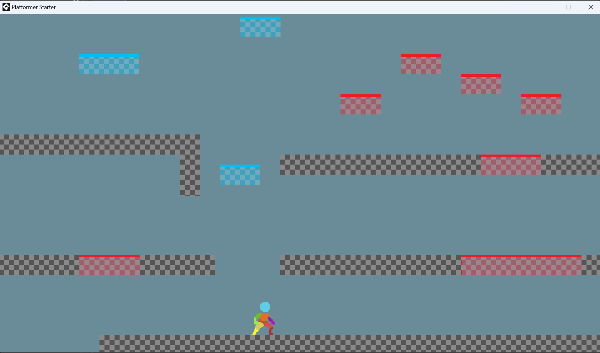

# Game Maker Platformer

## Description

A basic platformer for Game Maker, creating this as a starting point for my kids, I'll get all the basics working and then 
they can build from there.

## Features

- Player moment - left & right
- Player collision with ground objects on x axis
- Player collision with ground objects on y axis
- Player collision with Jump through platforms
- Player jumping (up to a max jump setting)
- Sprite switches based on movement
- Sprite faces correct direction

## Working on

- Collisions (In progress)
- Platforms (In progress)
- Jump through platforms & dropping down (In Progress)
- Moving platforms
- Dashing/Dodging/Rolling
- Wall climb and Wall hang
- Breakable walls/platforms
- Ladders

## How to run

- Download Game Maker
- Download the Project
- Open the Project in Game Maker and press play

## Credits

Player character is by https://zegley.itch.io/ - check his page for this asset [here](https://zegley.itch.io/2d-platformermetroidvania-asset-pack)
